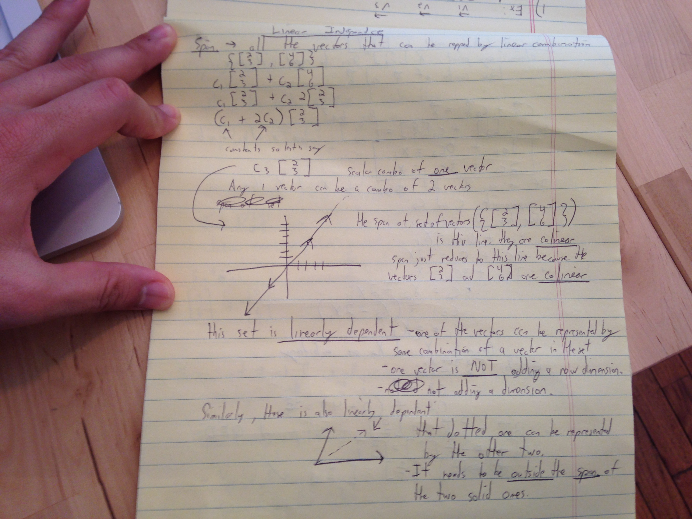
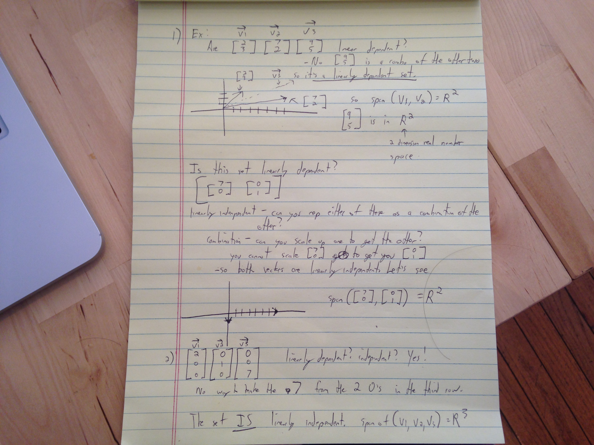

### Intro to linear independence

Remember **span** = all the vectors that can be represented by linear combinations.

**Linear independence** - a set is linearly independent if you cannot represent any element of the set as a linear combination of the others

**Linear combination** a vector is a linear combination of another if you can scale the other vector to become the vector in question. You cannot scale (7,0) to become (0,1) because of the 0.

Lesson:

examples of linear independence and dependence:

