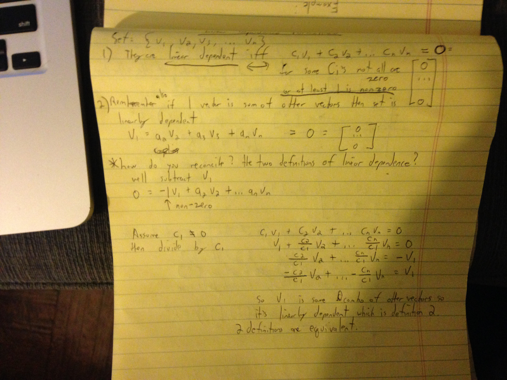
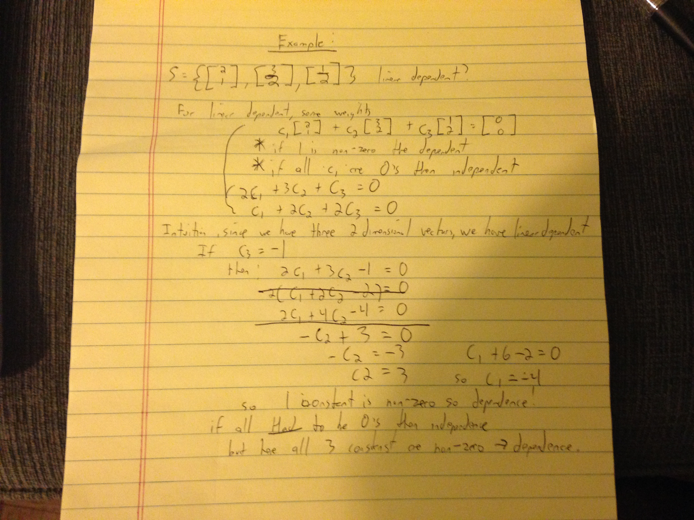
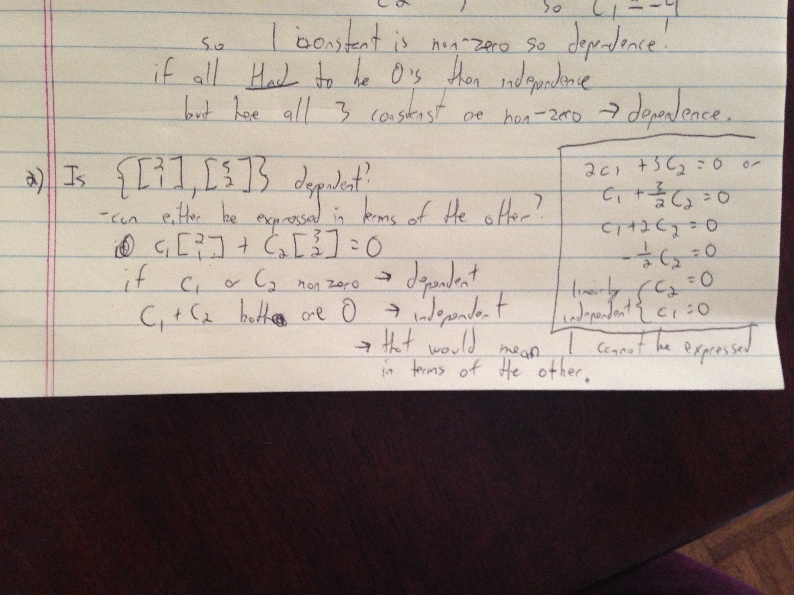

### Linear independence continued

1. It is linearly dependent if the linear combination of vectors = 0 vector = (0,0). This equation is written in the notes below. Linear dependent means that one of the vectors in the set is redundant. Some of the constants need to be non-zero. (imagine two vectors going opposite directions but same magnitude. The added value of the vectors would be 0 so they would be redundant.) This makes sense because if one of the vectors can be expressed in terms of the other and cancel it out to = 0, then they are dependent.

2. If one of the vectors can be expressed as a combination of the other vectors.

The two are equivalent proofs for linear dependency. I show that in the images.

Vectors are linearly independent if the only solution of some set of combinations of vectors equaling the 0 vector is if the constants are 0. If one of the constants are non zero, then they are linearly dependent. This makes sense because that implies that no vector can be expressed in terms of the other.

An example:

