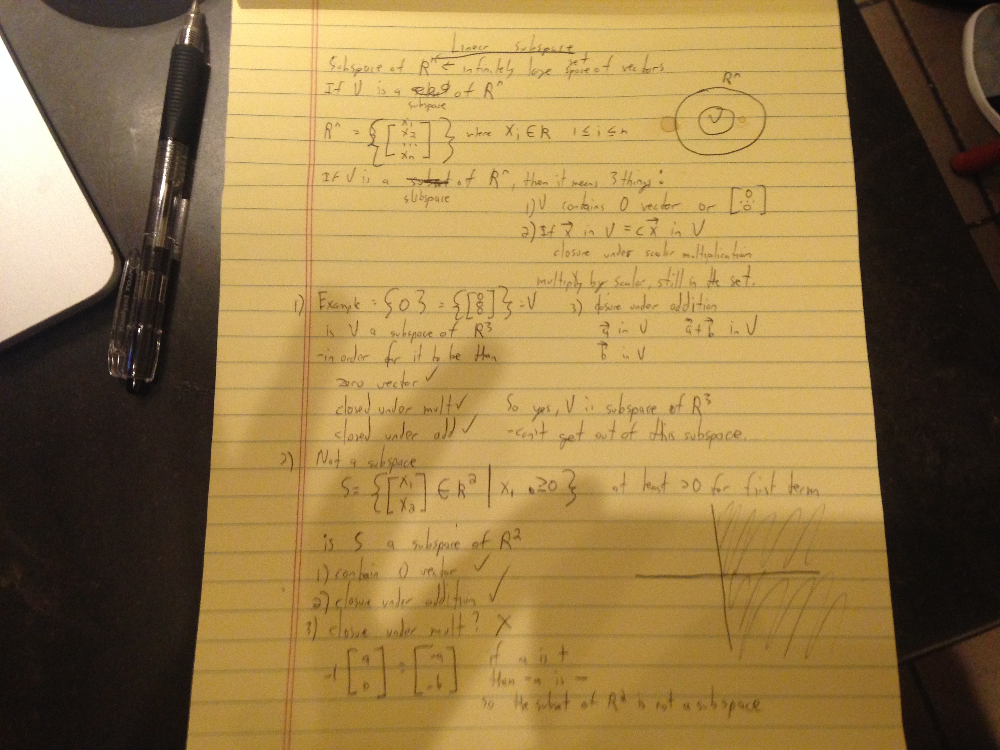

## subspaces

Subspace of R^n - set of vectors with n components. So if R^3 each vector in the subspace has 3 components.

Assume V is some **subset** of R^n. In order for V to be a **subspace** then 3 things:
1. V contains the 0 vector.
2. For a vector in V, any constant times the vector is also in V. This is closure under multiplication
3. For any two vector in V, those two vectors added together are in V.

If these conditions are met, then V is a subspace. All 3 points imply a subspace. That is a definition of a subspace.

