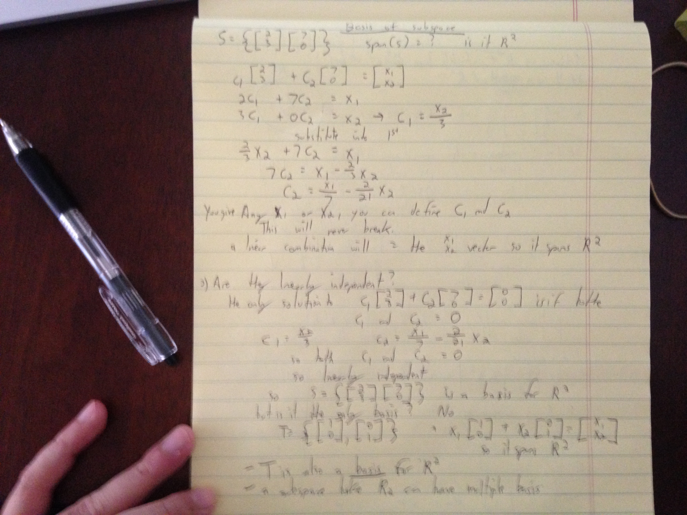

### Basis of subspace

V = span(v1, v2, v3, v4....vn)

Remember the span of any set of vectors is a valid subspace.
**Span** = all the linear combinations of the vectors. All the combinations using different constants. Multiply each vector by any constant and take all of those combinations is equal to the span.

If the span of the set of vectors = to the subspace and the vectors are linearly independent, you can say the set of vectors is a basis for the subspace.

If the vectors are linearly indpedent (the only way for the linear combination of the vectors to = 0 is if the constants are all 0 meaining that there is no way to represent one vector as a linear combination of the others).
Let S = {v1,v2,v3,v4....vn}
If S is a basis for V, then the span of the vectors you can construct/get to any of the vectors of that subspace and those vectors are linearly independent.

### Basis
- It is not a basis for a subspace if the vectors are not linearly independent.
- The minimum set of vectors that spans the space that it is a basis of.

A set of vectors can span the subspace but it may not be linearly independent. Therefore it is not a basis. If the set of vectors has a redundant vector, there is no redundancy.

