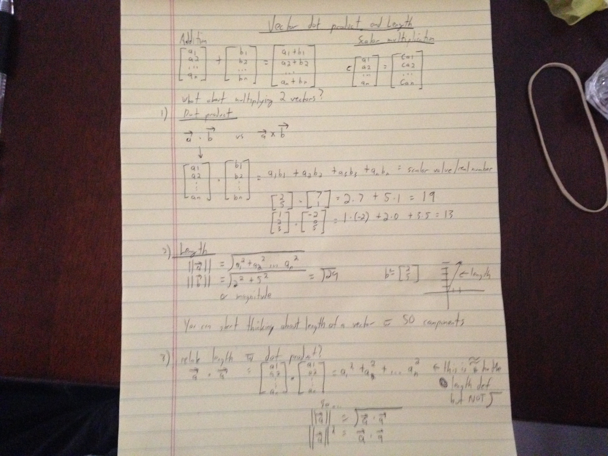
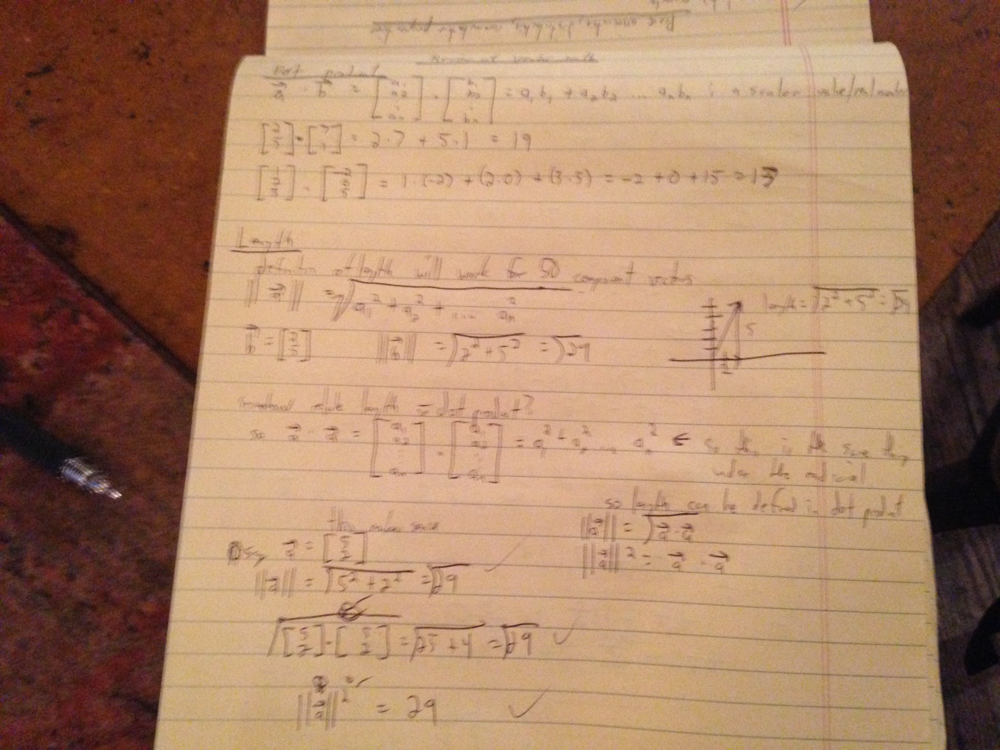

Showing properties now of vector math and vector proofs.


Commutative, distributive and Associative properties of vectors:


Additional notes:


More notes on dot product and length of vectors:


### Commutative property
In mathematics, a binary operation is commutative if changing the order of the operands does not change the result. It is a fundamental property of many binary operations, and many mathematical proofs depend on it. Most familiar as the name of the property that says "3 + 4 = 4 + 3" or "2 × 5 = 5 × 2", the property can also be used in more advanced settings. The name is needed because there are operations, such as division and subtraction, that do not have it (for example, "3 − 5 ≠ 5 − 3"), such operations are not commutative, or noncommutative operations. The idea that simple operations, such as multiplication and addition of numbers, are commutative was for many years implicitly assumed and the property was not named until the 19th century when mathematics started to become formalized.


### Associative property

The **associative property** states that you can add or multiply regardless of how the numbers are grouped. By 'grouped' we mean 'how you use parenthesis'. In other words, if you are adding or multiplying it does not matter where you put the parenthesis

In mathematics, the associative property is a property of some binary operations. In propositional logic, associativity is a valid rule of replacement for expressions in logical proofs.
Within an expression containing two or more occurrences in a row of the same associative operator, the order in which the operations are performed does not matter as long as the sequence of the operands is not changed. That is, rearranging the parentheses in such an expression will not change its value. Consider the following equations:

```
(2 + 3) + 4 = 2 + (3 + 4) = 9 \,
2 \times (3 \times 4) = (2 \times 3) \times 4 = 24 .
```

Even though the parentheses were rearranged, the values of the expressions were not altered. Since this holds true when performing addition and multiplication on any real numbers, it can be said that "addition and multiplication of real numbers are associative operations".

**Associativity is not to be confused with commutativity, which addresses whether a × b = b × a.**

The associative property states that you can add or multiply regardless of how the numbers are grouped. By 'grouped' we mean 'how you use parenthesis'. In other words, if you are adding or multiplying it does not matter where you put the parenthesis. Add some parenthesis any where you like!.

Definition: The associative property states that you can add or multiply regardless of how the numbers are grouped. By 'grouped' we mean 'how you use parenthesis'. In other words, if you are adding or multiplying it does not matter where you put the parenthesis. Add some parenthesis any where you like!.

a • b) •c = (a • b) •c
So multiplication is associative

But division is not.


### Distributive property

As generally used in math class, the distributive property is the ability of one operation to "distribute" over another operation contained inside a set of parenthesis. Most commonly, this refers to the property of multiplication distributing over addition or subtraction, such that x(a+b) = xa + xb.

When we say that multiplication distributes over addition, it means we can distribute the factor outside the set of parenthesis to each item inside, and then add the results. For example, 4(3+7) is equivalent to 4*3 + 4*7 because the multiplication by four was distributed across the addition inside the parenthesis.

Not every operation is distributive. For example, division is not distributive over addition. If we are given 20/(3+7) the true result is 2, but distributing would give you 20/3 + 20/7, which is around 10 and very incorrect!
