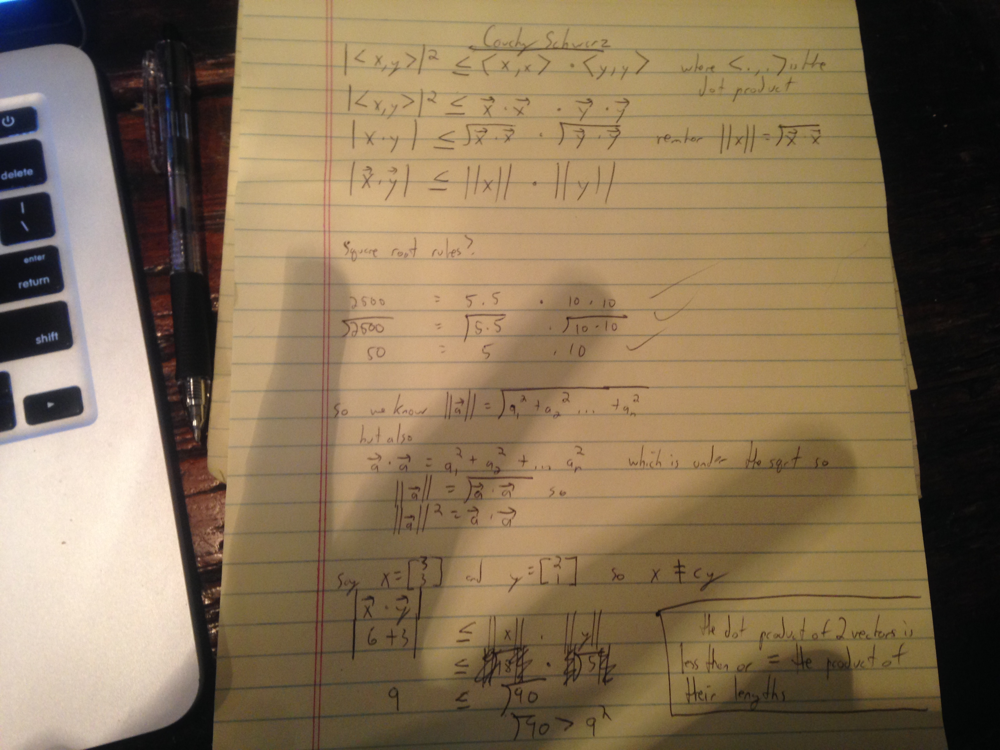

### Cauchy-schwarz inequality

Assume two vectors that are non zero and are both in the set of R^n.

It turns out:
1. The absolute value of their dot product is less than or equal to the product of their lengths.
2. The only times the dot product of the two vectors is = to the lengths of the product of their lengths only in the situation where one of the vectors is a scalar multiple of the other. The two vectors have to be colinear... one is a longer or shorter version of the other.

Some cauchy-schwarz extra work:

