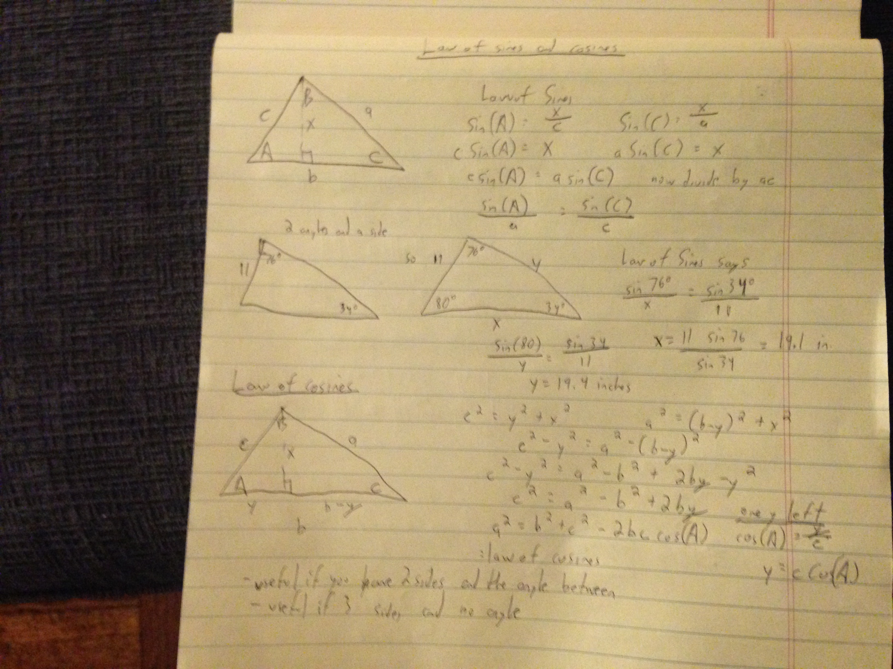
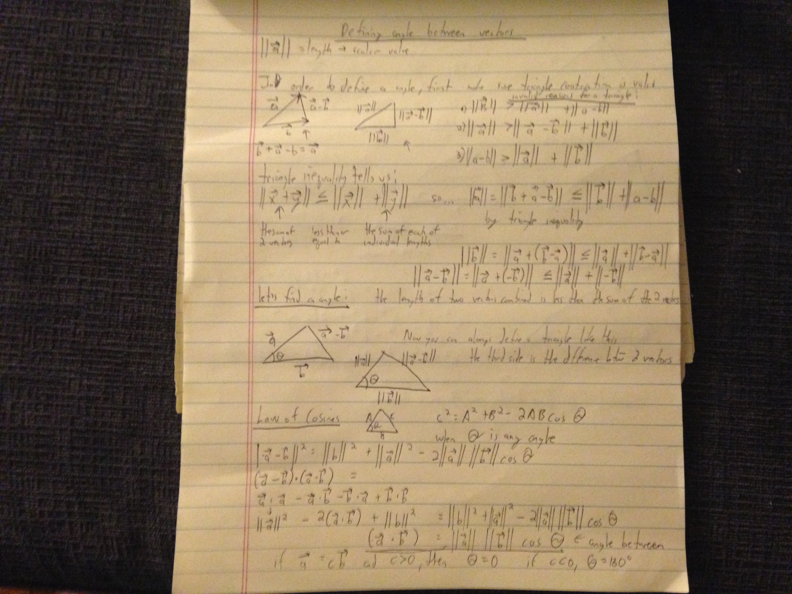
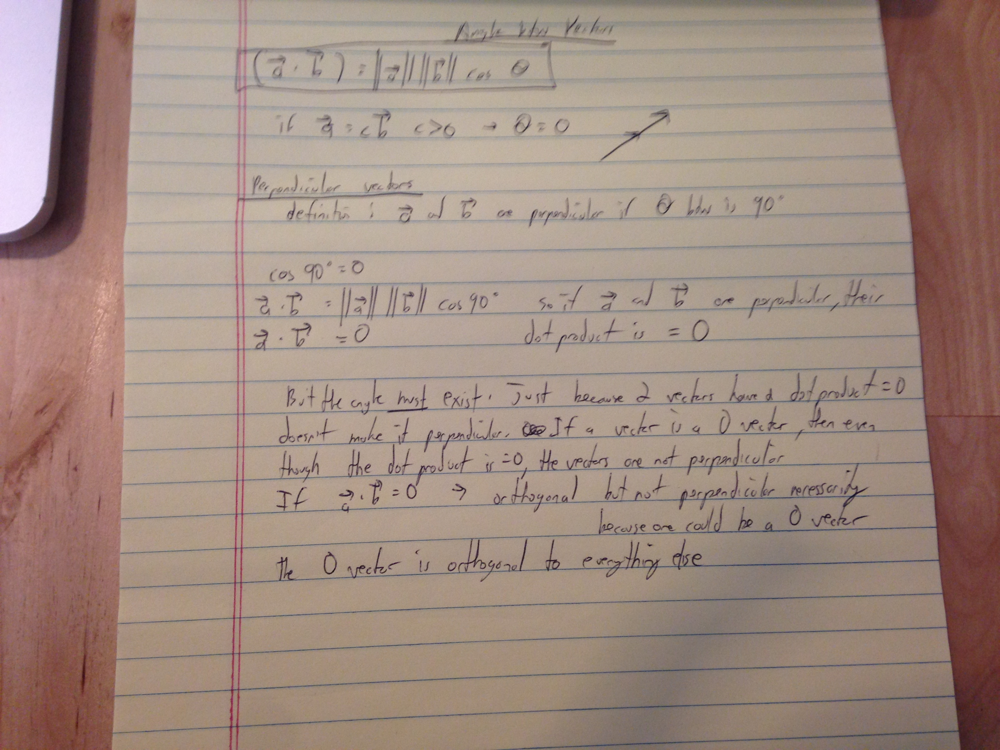
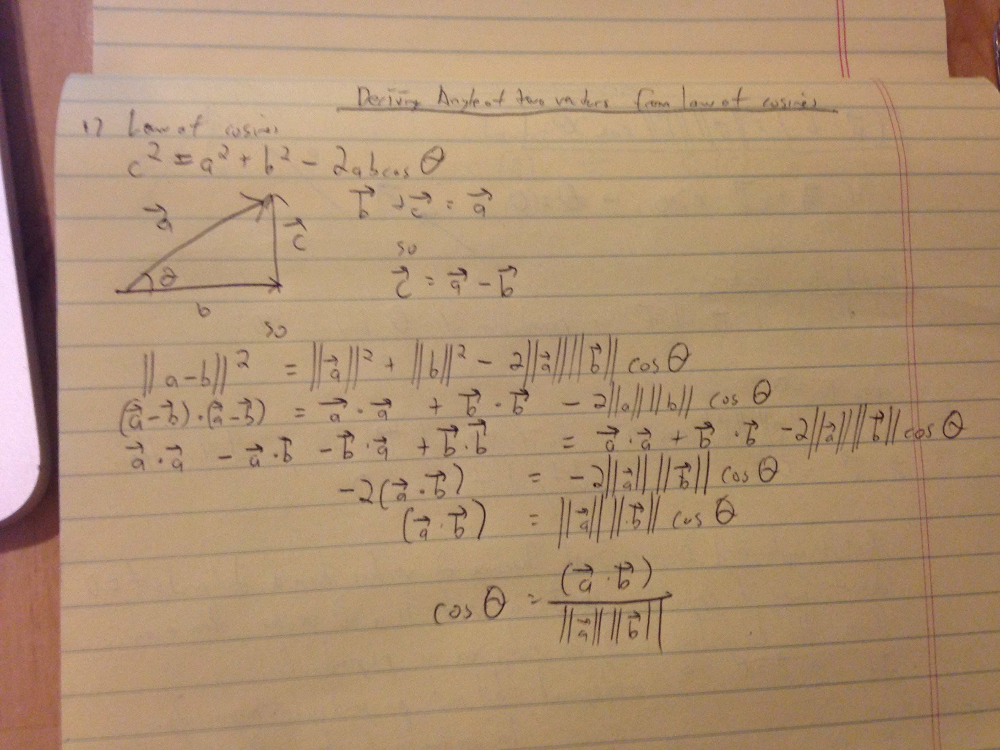

### Finding the angle

So if you have two vectors and the angle between them is what you need:
The dot product of the two vectors = the product of the lengths of the two vectors and the cosine of the angle between them.

First laws of sines and cosines reviewed:

The law of cosines is like a broader pythagorean theorem because the angle in between the two sides doesn't have to be a right angle.

Proof of that:

Perpendicular, orthogonal angles:

proof from law of cosines to the angle between two vectors:

