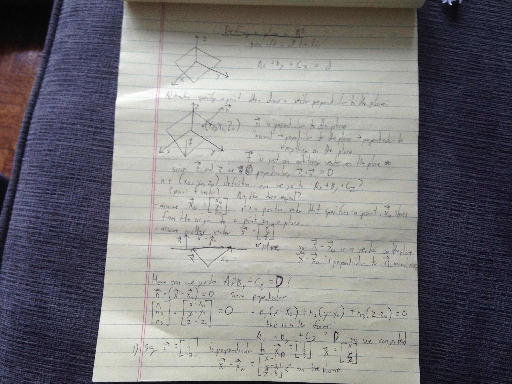
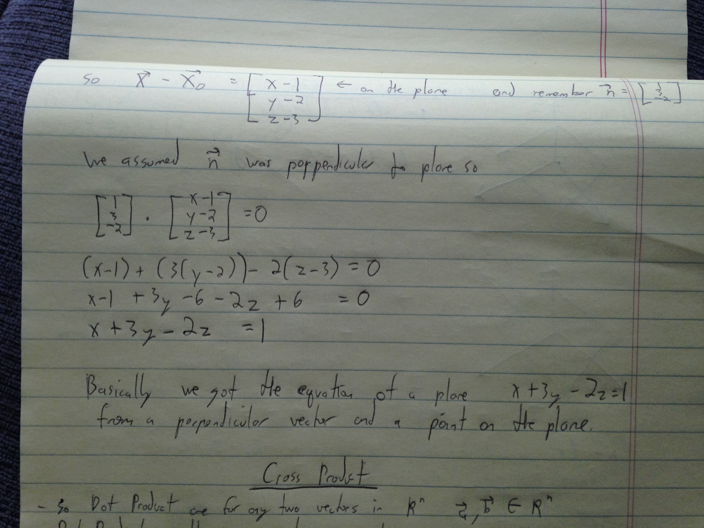

### Plane intro

Definition of a plane:  
**Ax + By + Cz = D**   

You can say that this is an equation for a plane.

You can also give an actual point on the plane like (X0, Y0, Z0). The point is not sufficient
because you can pivot the point around the plane. But you can also specify a normal vector
to the plane like n. Say n is a normal vector which is perpendicular to the plane.

You can also find the equation for a plane if you're given a vector that is perpendicular to the plane and two points on the plane. See here in this lesson:

continued:

The key to understanding this is that you need 2 points. The first point is a given point on the plane, the second point could be any point on the plane denoted by (x,y,z). The differential vector between the two points is now going to lie on the plane. And now you have the normal vector. And you know the dot product of the two have to = 0. So from here you can solve the equation for the plane which I think is infinitely wide.

Also read:
[wiki on plane definition](https://en.wikipedia.org/wiki/Plane_(geometry)#Point-normal_form_and_general_form_of_the_equation_of_a_plane)
