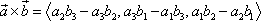
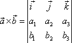
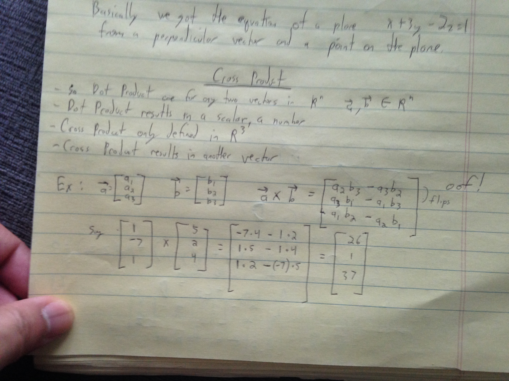
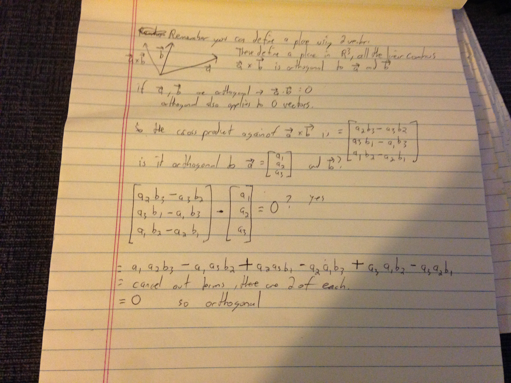

### Cross product

**What is it?**
1. In mathematics and vector calculus, the cross product or vector product (occasionally directed area product to emphasize the geometric significance) is a binary operation on two vectors in three-dimensional space (R3) and is denoted by the symbol ×. Given two linearly independent vectors a and b, the cross product, a × b, is a vector that is perpendicular to both and therefore normal to the plane containing them.

2. If two vectors have the same direction (or have the exact opposite direction from one another, i.e. are not linearly independent) or if either one has zero length, then their cross product is zero.
3. Note that the cross product requires both of the vectors to be three dimensional vectors.
4. The result of a dot product is a number and the result of a cross product is a vector!  Be careful not to confuse the two!
5. Equation:

This is not an easy formula to remember.  There are two ways to derive this formula.  Both of them use the fact that the cross product is really the determinant of a 3x3 matrix.  If you don’t know what this is that is don’t worry about it.  You don’t need to know anything about matrices or determinants to use either of the methods.  The notation for the determinant is as follows,

The first row is the standard basis vectors and must appear in the order given here.  The second row is the components of  and the third row is the components of .  Now, let’s take a look at the different methods for getting the formula.

Here are my hand-written notes:

**The cross product is orthogonal to both of the vectors that it is a cross-product of.**

In our context, the orthogonalness of the vectors is if a dot product b is equal 0. Remember orthogonal also applies to 0 vectors. The elements of the vectors can be 0.

Remember we can define a plane by two vectors. The linear combinations of the 2 2-element vectors form a plane in R^3. That makes sense.
