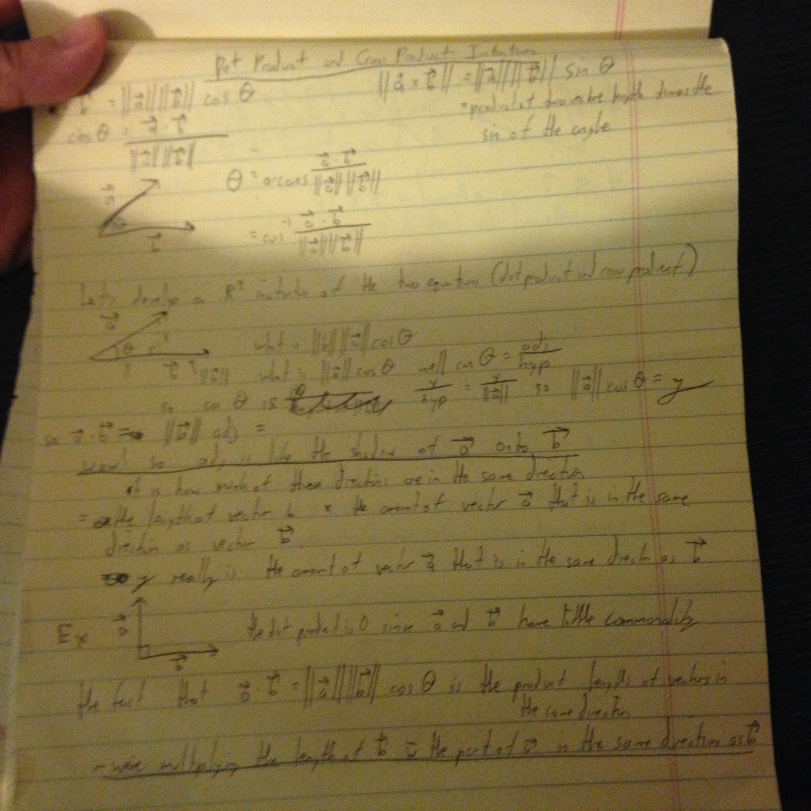

### What is the intuition behind the dot product and cross product?

Dot product:

Cross product:
The length of the cross product is the length of b times the part of a that is perpendicular to b. My notes go more into it. That's why the cross product is maximized when you have 2 perpendicular lines.

