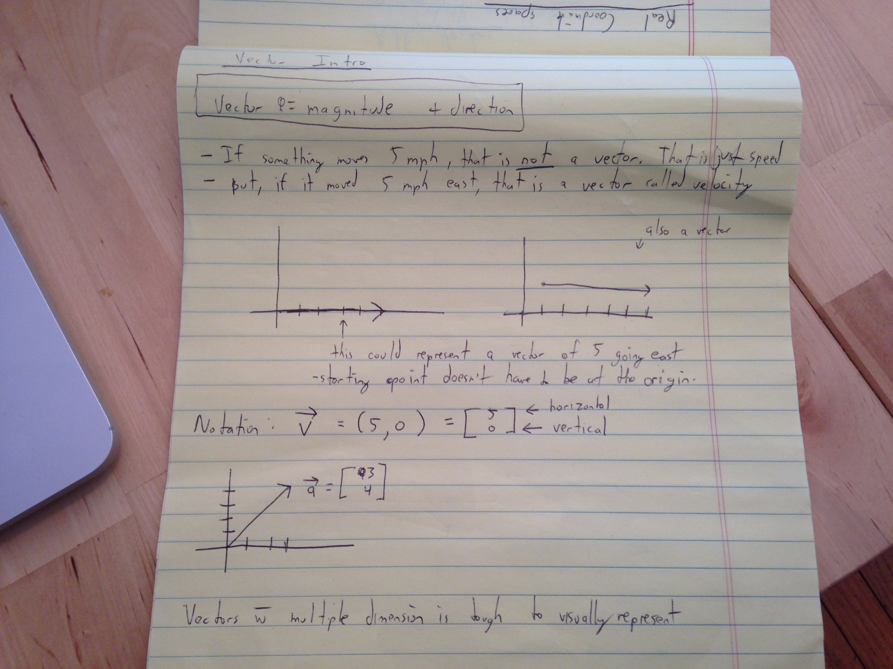

### Intro to vectors

https://www.khanacademy.org/math/linear-algebra/vectors_and_spaces/vectors/v/vector-introduction-linear-algebra

-vector has both magnitude and direction
-**vector = magnitude + direction**

IF something is moving at 5mph, that is not a vector quantity. It is not specifying a magnitude. It does not have
direction. That is merely a speed. That is not a vector quantity by itself. It is a scalar quantity. If you want a vector, you need to specify
a direction.

If you say something is moving 5mph due east, that is a vector quantity. That would be velocity which is a vector.
**velocity**: the speed of something in a given direction.

Let's operate in 2 dimension. You can draw an arrow in one direction with 5 dashes and that would represent a vector.
As long as it has a direction and a magnitude it is a vector

Using mathematical notation, you could write a vector as:

V = (5,0)
(The more accepted way of writing a vector is show in the image.)

The first coordinate represents how much we're moving in the horizontal direction, The second
coordinate represents how much we're moving in the vertical direction.

#### Key takeaways:
1. Vectors with multiple dimensions are tough to visually represent. This notation as show in the image helps.
2. Vectors need to have both magnitude and direction.
