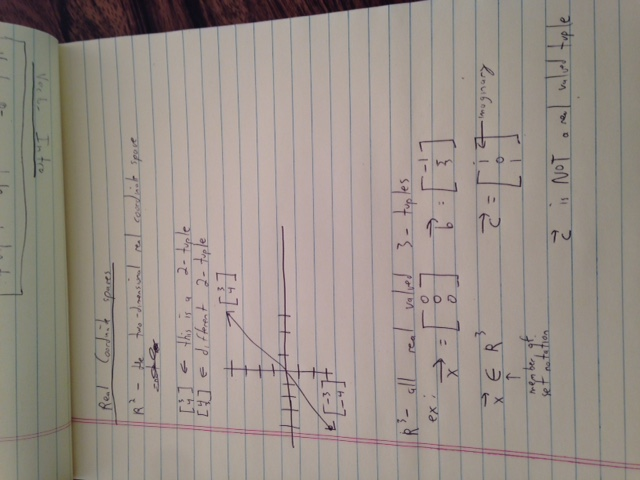

## Real coordinate spaces.
The two dimensional real coordinate space is not necessarily visually represented. It is simply a
two-dimension real coordinate space - all the possible real-valued 2-tuples. It DOES NOT necessarily have to be the
graphically represented linear cordinate plane that we use when graphing lines.

a tuple is an order list of numbers
a 2-tuple is an ordered list of 2 real valued numbers

####R^2 refers to all of the 2 dimensional real coordinate space.
- It includes 2-tuples like:
3,3      
-3,4      
0,0  

So you can keep extending the coordinate plane to higher degrees. The 4th and 5th dimensions are hard to visualize but
you can at least talk about it mathematically with notation like R^7. The 7-tuple real coordinate space cannot be represented visually but it is still a concept.

**Question:** Is it even possible to visualize in more than 3 dimensions?
Sample answer: Depends how you look at dimensions. For in space dimensions I think 3 is the maximum, however time, temperature, or any other variable (even mass, forces, moments, etc.) could be a dimension in the Nth space you are building or calculating in.

