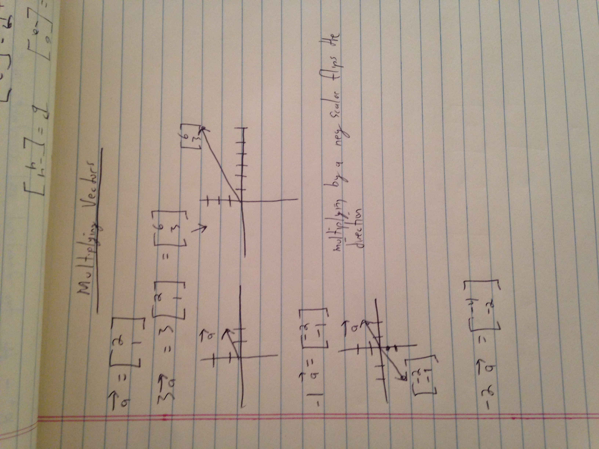

### You can multiply vectors by scalars

When you multiply a vector by a positive scalar, the direction is the same but you do change the magnitude.

You scale up a vector using a scalar. That's where the word scalar comes from.

If you multiply a vector by -1, something different happens.  The direction changes but magnitude is the same.

