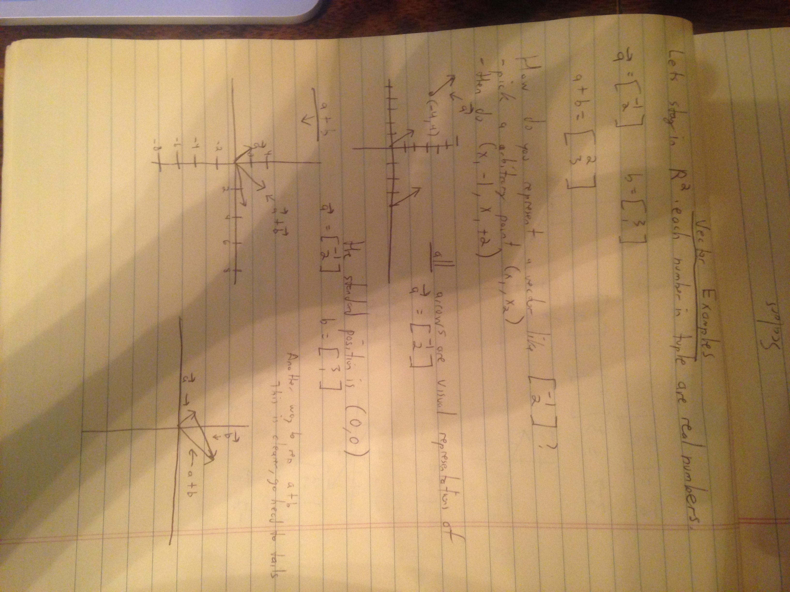
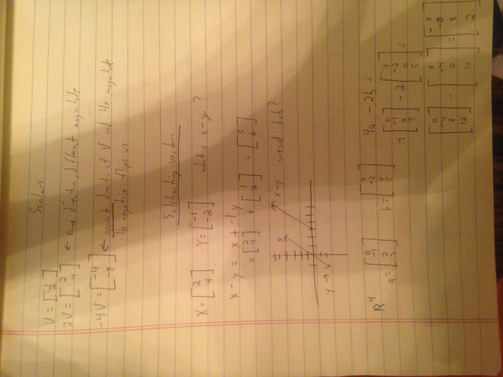
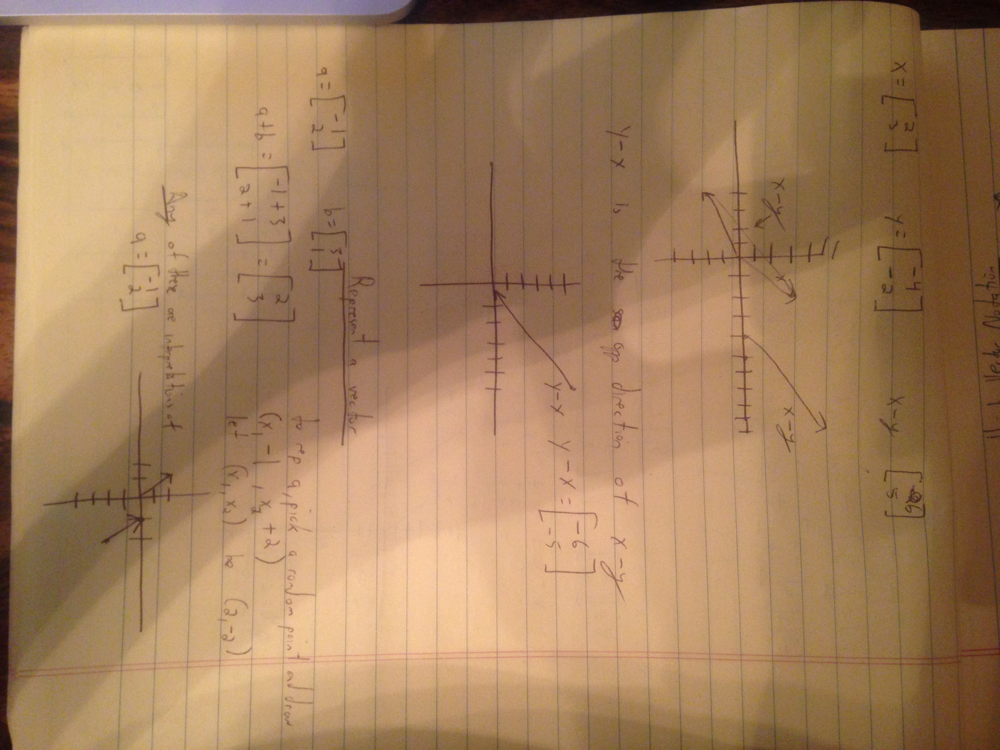

### Vector examples
In the following 3 images of notes, I will just be doing a lot of vector examples, mostly in the R^2 space.

By the way R^1 could be represented by a number line.

R^2 real coordinate plane is easy to draw. Real 2-tuples.

Interestingly enough, you can start your vectors anywhere. They are all parallel to each other but they can start from anywhere. This helps you visually represent adding vectors much better. I draw this in the image below.

When adding vectors, it's clearer to represent the relationship by putting the tail end of a vector to
the front end of another.

