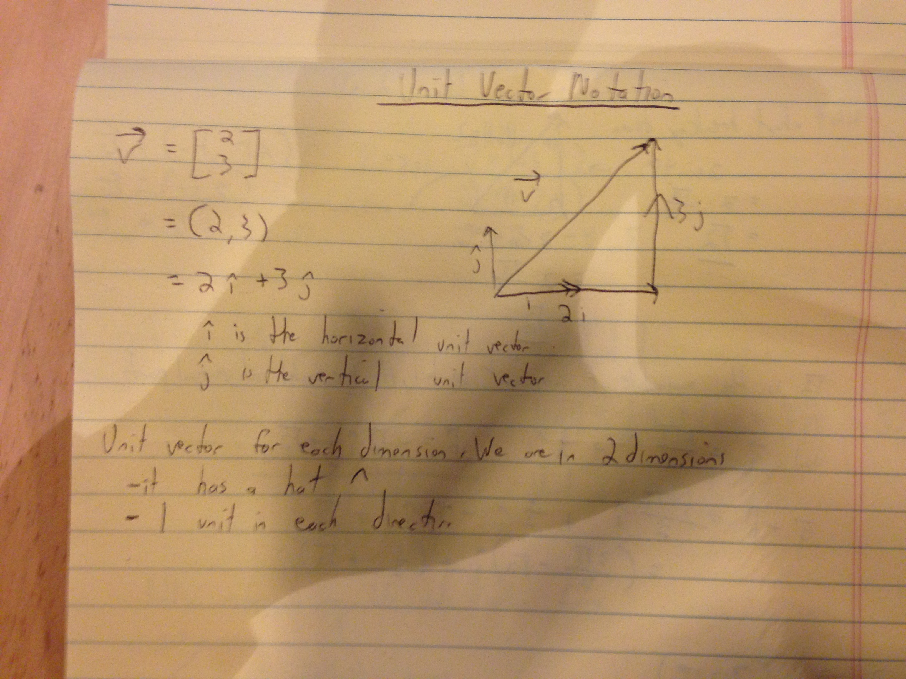

### Unit Vectors

If you want to find the unit vector of a vector, divide each component of the vector by the magnitude of a.

Denote unit vectors with little hats instead of an arrow on top.

A unit vector has a magnitude of 1.

I show this in the work below:

In the last line, the way I can show that (3/5, 4/5) has a magnitude of 1 is by using the Pythogorean Theorem. Square
each component of the vector, add the squares, square root it, and it should = 1.

Extra work:

Sample problem of adding vectors using component form:

