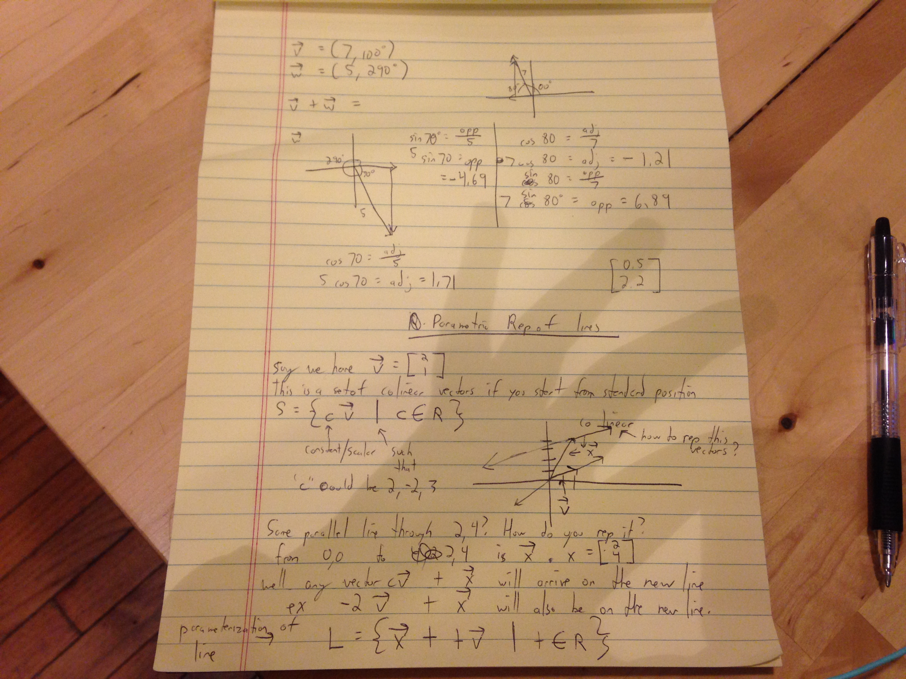

Even though this seems like an obtuse way to represent a line, parameterization of lines using this method allows you work more generally.

If you worked in R^2, you just need to worry about X's and Y coordinates.

But in larger coordinate planes in 3 dimensions or 4, you can use this method.

Here are my notes:

