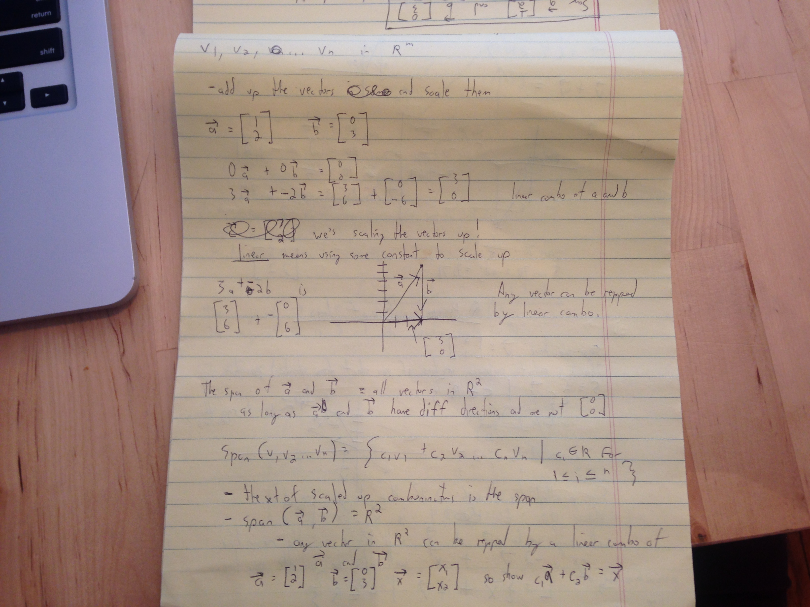

### Linear combinations and span

If you say the span of two vectors is R^2 (the coordinate plane of R^2) then what that means is that those two vectors in a linear combination can represent any vector in the R^2.

Some linear combination of those two vectors (the vector multiplied by a constant where the constant is a real number) can produce another vector in R^2.

Linear combinations, in short, are some combination of vectors where each vector is multipled by a constant.

